# java_design_patterns-高密度卡片系统设计大图.md

本文件定义了 **java-design-patterns (设计模式与并发架构)** 28张核心知识卡片之间的依赖拓扑结构，以及物理代码映射锚点。

---

## 🗺️ 28 张卡片依赖拓扑图 (Mermaid)

```mermaid
graph TD
    classDef default fill:#151d30,stroke:#24324f,color:#e2e8f0;
    classDef M1 fill:#4B5F7A,stroke:#2f3d52,color:white;
    classDef M2 fill:#6B8272,stroke:#4b5c50,color:white;
    classDef M3 fill:#9C6666,stroke:#704949,color:white;
    classDef M4 fill:#7A7A7A,stroke:#595959,color:white;
    classDef M5 fill:#9A825A,stroke:#6e5c40,color:white;
    classDef M6 fill:#755B77,stroke:#534054,color:white;

    Card1["Card 1: Singleton Volatile"]:::M1
    Card2["Card 2: Factories"]:::M1
    Card3["Card 3: Dynamic Proxy"]:::M1
    Card4["Card 4: Adapter Decorator"]:::M1
    Card5["Card 5: Facade Flyweight"]:::M1
    
    Card6["Card 6: Observer Event"]:::M2
    Card7["Card 7: Strategy State"]:::M2
    Card8["Card 8: Template Command"]:::M2
    Card9["Card 9: Chain of Resp"]:::M2
    Card10["Card 10: Mediator Memento"]:::M2

    Card11["Card 11: DTO Entity"]:::M3
    Card12["Card 12: DAO Repository"]:::M3
    Card13["Card 13: Front Controller"]:::M3
    Card14["Card 14: Circuit Breaker"]:::M3
    Card15["Card 15: CQRS EventSource"]:::M3

    Card16["Card 16: Java Thread Model"]:::M4
    Card17["Card 17: JMM & Volatile"]:::M4
    Card18["Card 18: ThreadPoolExecutor"]:::M4
    Card19["Card 19: ThreadLocal Leak"]:::M4

    Card20["Card 20: AQS CLH Queue"]:::M5
    Card21["Card 21: CAS & ABA Version"]:::M5
    Card22["Card 22: ConcurrentHashMap"]:::M5
    Card23["Card 23: Synchronized Lock"]:::M5
    Card24["Card 24: Deadlock Check"]:::M5

    Card25["Card 25: Reactive Backpressure"]:::M6
    Card26["Card 26: Flux Mono Schedulers"]:::M6
    Card27["Card 27: CompletableFuture"]:::M6
    Card28["Card 28: ForkJoinPool Steal"]:::M6

    Card1 --> Card3
    Card3 --> Card9
    Card4 --> Card9
    Card5 --> Card12
    Card6 --> Card14
    Card7 --> Card8
    Card8 --> Card9
    Card9 --> Card13
    Card11 --> Card12
    Card12 --> Card15
    Card13 --> Card15
    Card16 --> Card17
    Card17 --> Card20
    Card17 --> Card23
    Card18 --> Card27
    Card19 --> Card18
    Card20 --> Card24
    Card21 --> Card20
    Card22 --> Card21
    Card23 --> Card24
    Card25 --> Card26
    Card27 --> Card28
```

---

## 📍 Java Design Patterns 物理源码位置映射

本设计大图的知识节点与 Java 核心类库及企业级框架物理源码强关联：
1. **Dynamic Proxy**: JDK 反射库中的 `java.lang.reflect.Proxy.java`。
2. **AQS & Synchronizers**: Java 并发包 `java.util.concurrent.locks.AbstractQueuedSynchronizer.java`。
3. **Concurrent Containers**: `java.util.concurrent.ConcurrentHashMap.java` 内部的 CAS 桶节点及 TreeBin 红黑树类。
4. **ForkJoin Work-Stealing**: `java.util.concurrent.ForkJoinPool.java` 中的 WorkQueue 双端操作。
