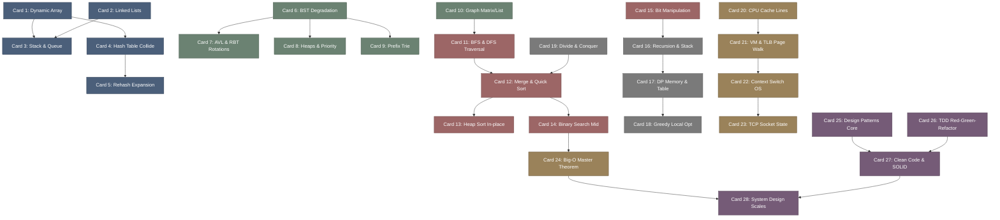

# coding_interview_university-高密度卡片系统设计大图.md

本文件定义了 **coding-interview-university (计算机科学体系与底层工程素养)** 28张核心知识卡片之间的依赖拓扑结构，以及物理代码映射锚点。

---

## 🗺️ 28 张卡片依赖拓扑图 (Mermaid)

---

## 📍 Coding Interview University 物理映射锚点

本设计大图的知识节点与计算机系统级、软件工程规范进行底层物理映射：
1. **CPU Cache Line**: x86-64 及 ARM 架构中一致的 64 字节数据块对齐访存（如 C++ 中的 `alignas(64)`）。
2. **VM & TLB Page Walk**: 处理器 MMU 底层页表翻译逻辑（如 Linux 系统中对 `/proc/sys/vm/nr_hugepages` 的调优）。
3. **TCP Socket State**: 操作系统 TCP/IP 协议栈状态转移，与 Linux 的 `netstat` / `ss` 状态直接关联。
4. **Master Theorem**: 算法渐进复杂度中递归分治表达式 $T(N) = aT(N/b) + f(N)$ 的数学闭式解。
