# rust_patterns-高密度卡片系统设计大图.md

本文件定义了 **rust_patterns (高级借用设计模式与 Typestate)** 28张核心知识卡片之间的依赖拓扑结构，以及物理代码映射锚点。

---

## 🗺️ 28 张卡片依赖拓扑图 (Mermaid)

```mermaid
graph TD
    classDef default fill:#151d30,stroke:#24324f,color:#e2e8f0;
    classDef M1 fill:#4B5F7A,stroke:#2f3d52,color:white;
    classDef M2 fill:#6B8272,stroke:#4b5c50,color:white;
    classDef M3 fill:#9C6666,stroke:#704949,color:white;
    classDef M4 fill:#7A7A7A,stroke:#595959,color:white;
    classDef M5 fill:#9A825A,stroke:#6e5c40,color:white;

    Card1["Card 1: RAII Guard"]:::M1
    Card2["Card 2: Typestate Pattern"]:::M1
    Card3["Card 3: Type-safe Builder"]:::M1
    Card4["Card 4: Newtype Pattern"]:::M1
    Card5["Card 5: Pinning Self-Refs"]:::M1
    Card6["Card 6: Interior Mutability"]:::M1
    Card7["Card 7: Orphan Rule Extensions"]:::M2
    Card8["Card 8: Visitor AST Deserializer"]:::M2
    Card9["Card 9: Strategy Dispatch"]:::M2
    Card10["Card 10: RAII Rollback Guard"]:::M2
    Card11["Card 11: Typestate Protocol"]:::M2
    Card12["Card 12: Deref Coercion"]:::M2
    Card13["Card 13: Lazy Iterators"]:::M3
    Card14["Card 14: PhantomData Markers"]:::M3
    Card15["Card 15: Command Invoker"]:::M3
    Card16["Card 16: Observer Event Bus"]:::M3
    Card17["Card 17: Abstract Factory"]:::M3
    Card18["Card 18: OnceCell Singleton"]:::M3
    Card19["Card 19: Flyweight Cow Pool"]:::M3
    Card20["Card 20: Memento Snapshot"]:::M4
    Card21["Card 21: Adapter Wrapper"]:::M4
    Card22["Card 22: Bridge Component"]:::M4
    Card23["Card 23: Decorator Wrapper"]:::M4
    Card24["Card 24: Chain Middleware"]:::M4
    Card25["Card 25: Dynamic State Trait"]:::M5
    Card26["Card 26: Template Method Hook"]:::M5
    Card27["Card 27: FFI Safe Wrapper"]:::M5
    Card28["Card 28: Actor Channel Isolated"]:::M5

    Card1 --> Card10
    Card2 --> Card11
    Card3 --> Card2
    Card4 --> Card7
    Card5 --> Card14
    Card6 --> Card16
    Card12 --> Card4
    Card13 --> Card9
    Card14 --> Card2
    Card18 --> Card17
    Card19 --> Card20
    Card21 --> Card22
    Card23 --> Card22
    Card24 --> Card28
    Card25 --> Card26
    Card27 --> Card21
```

---

## 📂 核心设计模式物理映射锚点

在高级 Rust 开发中，设计模式并非虚无的哲学，而是深深扎根于编译器及各大流行开源生态库的核心代码实现中：

*   `std::ops::Deref`: 强转重载，智能指针（Box, Arc, Rc）支持隐式方法解析的核心机制。
*   `std::pin::Pin`: 内存固定指针包装器，约束底层自引用结构在发生 Move 时保持物理地址一致，广泛应用于异步 Future 状态机中。
*   `std::marker::PhantomData`: 虚无零大小标记体，用于在泛型中指导借用检查器（Borrow Checker）关于所有权和生存期的静态判定。
*   `serde::de::Visitor`: 序列化框架解耦器，定义与物理序列格式无关的属性访问回调树以驱动无拷贝反序列化。
*   `tokio::sync::mpsc`: 多生产者单消费者信道，在异步 Actor 框架中作为信箱（Mailbox）进行并发调度与状态隔离的底层支柱。
*   `std::panic::catch_unwind`: FFI 恐慌拦截门槛，捕获线程栈回溯防止 Rust unwind 跨越 C 接口边界导致操作系统直接崩溃。

---

## 🔬 Zone T2: 借用安全与高级模式运行字典

*   `borrow_mut_already_borrowed_panic`: 运行时由于多处同时发起了 `RefCell::borrow_mut()` 修改请求，违背了独占写规则，抛出 Panic 崩溃。
*   `self_referential_dangling_pointer_error`: 在未执行 Pinning 约束的自引用结构体发生 Move 后，读取原指针导致访问已被销毁的物理内存栈页。
*   `typestate_invalid_transition_compile_error`: 强行在编译阶段调用当前生命状态下未实现的相关接口，引发类型匹配失败从而编译被阻断。
*   `orphan_rule_implementation_denied`: 试图为一个外部的 crate 类型实现另一个外部的 trait，违背了孤儿规则规则，被编译器静态拦截。
*   `ffi_boundary_panic_abort`: Rust 内部触发的 Panic 恐慌未能通过 `catch_unwind` 拦截，跨越 C-FFI 接口直接导致底层宿主程序意外退出。
*   `once_cell_redefinition_failed`: 全局静态 OnceCell 已经被前置线程写入，再次发起初始化请求导致重写失败返回报错。
