# production_survival-高密度卡片系统设计大图.md

本文件定义了 **production_survival (业务工程学与防雪崩重构)** 28张核心知识卡片之间的依赖拓扑结构，以及物理代码/组件映射锚点。

---

## 🗺️ 28 张卡片依赖拓扑图 (Mermaid)

```mermaid
graph TD
    classDef default fill:#151d30,stroke:#24324f,color:#e2e8f0;
    classDef M1 fill:#4B5F7A,stroke:#2f3d52,color:white;
    classDef M2 fill:#6B8272,stroke:#4b5c50,color:white;
    classDef M3 fill:#9C6666,stroke:#704949,color:white;
    classDef M4 fill:#7A7A7A,stroke:#595959,color:white;
    classDef M5 fill:#9A825A,stroke:#6e5c40,color:white;

    Card1["Card 1: Strangler Fig"]:::M1
    Card2["Card 2: Anti-Corruption Layer"]:::M1
    Card3["Card 3: Dual-Write Migration"]:::M1
    Card4["Card 4: Outbox Pattern"]:::M1
    Card5["Card 5: Saga Orchestration"]:::M1
    Card6["Card 6: Idempotency Keys"]:::M1
    Card7["Card 7: Token Bucket Limiter"]:::M2
    Card8["Card 8: Circuit Breaker"]:::M2
    Card9["Card 9: Bulkhead Isolation"]:::M2
    Card10["Card 10: Graceful Degradation"]:::M2
    Card11["Card 11: Optimistic ETag"]:::M2
    Card12["Card 12: API Versioning"]:::M2
    Card13["Card 13: Schema Expand-Contract"]:::M3
    Card14["Card 14: Shadow Database"]:::M3
    Card15["Card 15: Chaos Fault Injection"]:::M3
    Card16["Card 16: Reconciliation Sync"]:::M3
    Card17["Card 17: Backoff Jitter"]:::M3
    Card18["Card 18: Dead Letter Queue"]:::M3
    Card19["Card 19: Facade Pattern"]:::M3
    Card20["Card 20: Feature Canaries"]:::M4
    Card21["Card 21: Backpressure flow"]:::M4
    Card22["Card 22: Rolling Update"]:::M4
    Card23["Card 23: Lock Lease Dog"]:::M4
    Card24["Card 24: CQRS Sync"]:::M4
    Card25["Card 25: Client-side LoadBalancer"]:::M5
    Card26["Card 26: Liveness Readiness Probes"]:::M5
    Card27["Card 27: W3C Trace Context"]:::M5
    Card28["Card 28: Correlation ID Logs"]:::M5

    Card1 --> Card19
    Card2 --> Card1
    Card3 --> Card13
    Card3 --> Card16
    Card4 --> Card5
    Card6 --> Card4
    Card7 --> Card21
    Card8 --> Card9
    Card9 --> Card10
    Card11 --> Card6
    Card14 --> Card15
    Card17 --> Card18
    Card20 --> Card22
    Card23 --> Card6
    Card24 --> Card4
    Card25 --> Card26
    Card27 --> Card28

    class Card1,Card2,Card3,Card4,Card5,Card6 M1;
    class Card7,Card8,Card9,Card10,Card11,Card12 M2;
    class Card13,Card14,Card15,Card16,Card17,Card18,Card19 M3;
    class Card20,Card21,Card22,Card23,Card24 M4;
    class Card25,Card26,Card27,Card28 M5;
```

---

## 📂 核心模式物理/组件映射锚点

在微服务与高可用架构开发中，高可用与重构模式映射于以下核心开源组件与代码结构中：

*   `Netflix Resilience4j / Sentinel`: 客户端流量防卫兵，定义熔断器（CircuitBreaker）、舱壁隔离（Bulkhead）和限流器（RateLimiter）核心逻辑的底层包。
*   `Kubernetes Readiness/Liveness Probes`: K8s 编排探针，依据 `/ready` 或 `/healthz` HTTP 返回码动态调整容器路由指向与重启策略。
*   `Debezium / Canal`: 事务变更捕获组件（CDC），通过追溯数据库本地 Binlog 实现无侵入的发件箱（Outbox）事件异步投递与双写对账。
*   `Spring Cloud Gateway / Kong`: 边缘网关拦截层，实现全局令牌桶限流、动态路由、W3C 追踪上下文（Correlation ID）提取与转发的集中化入口。
*   `W3C Trace Context Standard`: 分布式追踪协议（`traceparent` 头），定义了跨网络边界进行链路 TraceID/SpanID 透传的统一格式。
*   `Flyway / Liquibase`: 数据库迁移版本控制工具，管理 Expand-Contract 阶段的多版本 SQL 表迁移变更脚本。

---

## 🔬 Zone T2: 高可用故障与重构运行字典

*   `cascading_thread_pool_exhaustion_panic`: 由于下游服务故障阻塞且无舱壁隔离，导致网关或上游线程池资源耗尽，拖垮整个集群的致命级雪崩故障。
*   `dirty_data_write_skew_migration_error`: 在执行双写数据库迁移时，由于并发竞态或缺失对账补偿机制，导致新旧数据库产生写入偏斜与非一致。
*   `idempotent_duplicate_submission_intercept`: 当由于网络超时重试导致相同的请求再次发起时，被 Redis 幂等键成功拦截返回缓存结果的防御性拦截。
*   `circuit_breaker_open_fast_fail_triggered`: 熔断器状态由半开或正常切为 OPEN（开启），直接拦截真实调用，瞬间执行快速失败并退回 Fallback 的故障包隔离。
*   `poison_pill_max_retry_exhaust_dlq_redirect`: 包含解析错误的死信消息在多次重试后依旧报错，最终消耗完重试次数，被系统推入死信队列的日志隔离动作。
*   `watchdog_lease_renewal_lock_expiration`: 业务处理发生 Full GC 或长时间停顿，看门狗未能及时续签租约锁，导致分布式锁在业务未执行完时被提前释放的异常。
