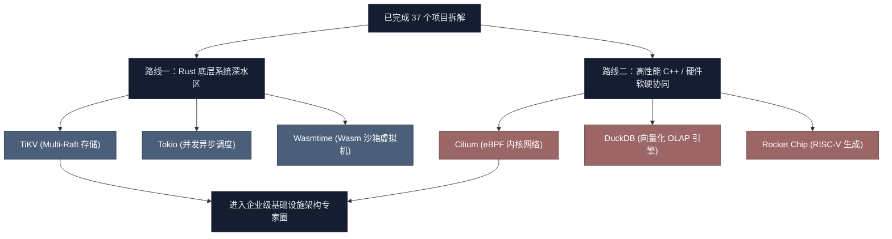

# GitHub 硬核系统工程：下一阶段挑战项目审计与规划报告

本报告针对已完成的 37 个硬核系统工程项目，结合您对物理目录的重新分类与整理（**01-11个核心领域**），从 GitHub 上筛选出当前最具技术深度、架构挑战性以及行业影响力的开源系统级项目。这些项目将作为下一阶段深入探索的“硬骨头”题材。

---

## 🎨 领域挑战矩阵一览表

| 领域分类 | 建议挑战项目 (GitHub Repo) | 核心开发语言 | GitHub Stars | 2025/2026 活跃度与更新状态 | 挑战点与核心硬件/系统机制 |
| :--- | :--- | :--- | :--- | :--- | :--- |
| **01-distributed-systems** | **[TiKV](https://github.com/tikv/tikv)** | Rust | ~16k | CNCF 毕业项目，作为 TiDB 基石，目前高频维护与更新 | Multi-Raft 组分裂与合并、高并发 MVCC 事务流、RocksDB 存储引擎高度集成 |
| | **[Maelstrom](https://github.com/jepsen-io/maelstrom)** | Clojure/Go | ~7.2k | Jepsen 团队持续维护，分布式一致性测试的事实标准 | 仿真分布式网络分区、丢包、乱序，检验共识协议安全性与线性一致性 |
| **02-database-internals** | **[DuckDB](https://github.com/duckdb/duckdb)** | C++ | 30k+ | **超高频爆发式更新**，OLAP 领域极热新贵，近一年快速迭代 | 进程内列式 OLAP 引擎、Vectorized 向量化执行、实时数据重平衡与冷热压实 |
| | **[Sled](https://github.com/spacejam/sled)** | Rust | ~8.1k | Rust 嵌入式存储探索，2025-2026 进行大规模并发无锁重构 | Flash-native 闪存友好架构、完全无锁化 B-Link 树与单页面置换算法 |
| **03-operating-systems** | **[Cilium](https://github.com/cilium/cilium)** | Go/C (eBPF) | 20k+ | **云原生主力组件**，日均数十次 Commit，各大云厂商默认 K8s 网络标准 | XDP 极速旁路网络、Maglev 一致性哈希、内核级 Socket 重定向（sockops） |
| | **[Seastar](https://github.com/scylladb/seastar)** | C++ | ~4.5k | ScyllaDB 团队高频维护，现代 C++ 高性能无锁共享网络开发框架 | Shard-per-core 零锁共享架构、非阻塞微任务调度、物理网卡 PMD 轮询驱动 |
| **04-computer-networks** | **[Tokio](https://github.com/tokio-rs/tokio)** | Rust | 25k+ | Rust 异步生态绝对霸主，2026年持续发布补丁与维护，生态极其庞大 | 多线程 Work-Stealing 任务调度器、Loom 线程竞争检测、非阻塞 epoll/IOCP 抽象 |
| | **[dae](https://github.com/daeuniverse/dae)** | Go/C (eBPF) | ~5.8k | **快速崛起新秀**，2026年迭代频繁，基于 eBPF 的高性能透明路由代理 | 零拷贝透明代理、内核层 3 环过滤拦截、物理网卡硬流分发（tc-bpf） |
| **05-system-design** | **[Dapr](https://github.com/dapr/dapr)** | Go | 24k+ | 微软主导，云原生 Sidecar 规范实现，2026持续快速迭代 | 边车（Sidecar）架构多协议适配、Actor 状态机分布式协同、弹性重试自愈 |
| **06-compilers-and-runtimes** | **[Wasmtime](https://github.com/bytecodealliance/wasmtime)** | Rust | 15k+ | **极其活跃**，每月 20 日准时发布 major 版本，2026年6月发布 WASI 0.3 异步标准 | Standalone Wasm JIT 编译（Cranelift）、轻量级沙箱内存线性隔离 |
| | **[rustc](https://github.com/rust-lang/rust)** | Rust | 100k+ | 语言基石，全球数千核心开发者每日高频 Commit | MIR/HIR 编译多阶段分析、借用检查器（Borrow Checker）非词法作用域安全 |
| **07-performance-and-diagnostics** | **[bpftrace](https://github.com/bpftrace/bpftrace)** | C++ | ~14k | 随 Linux 内核演进保持高频维护，命令行内核动态追踪的绝对主力 | 动态内核探针语法解析、LLVM IR 动态即时生成、高频 perf 计数与聚合 |
| **08-computer-architecture** | **[Rocket Chip](https://github.com/chipsalliance/rocket-chip)** | Chisel/Scala| ~2.2k | RISC-V 社区基础底座，Chips Alliance 核心项目，持续维护 | 参数化 RISC-V 处理器生成器、TileLink 总线互连、Cache 一致性协议自动生成 |
| **09-cryptography-and-security** | **[Rustls](https://github.com/rustls/rustls)** | Rust | ~5.5k | **现代 TLS 明星项目**，2025-2026 作为 OpenSSL 的内存安全替代品高频更新 | 内存安全 TLS 1.3 状态机、Ring 硬件加密指令集封装、拒绝側信道漏洞机制 |
| **10-physical-systems-and-control**| **[ROS 2](https://github.com/ros2/ros2)** | C++/Python | ~3.8k | 机器人操作系统行业标准，各发行版（如 Jazzy Jalisco 2026）持续演进 | DDS 实时中间件通信规范、零拷贝物理内存传输共享、实时优先级调度保证 |
| **11-software-methodologies**| **[Rust Patterns](https://github.com/rust-unofficial/patterns)**| Rust | 40k+ | Rust 社区共同维护的设计模式字典，随语言版本迭代保持更新 | 借用与生命周期模式解耦、无分配类型安全（Typestate）、零成本抽象设计 |

---

## 🔬 重点推荐项目深度解构

### 📂 成果领域 01: TiKV (分布式事务 Key-Value 引擎)
*   **为什么值得挑战**: TiKV 是 TiDB 的高可靠分布式底层引擎，代表了工业级分布式数据库的顶尖难度。它通过在单个进程内多路复用数千个小 Raft 组（Multi-Raft）来实现分片（Region）的水平扩展，并在之上构建了符合 Percolator 模型的分布式两阶段提交（2PC）事务流。
*   **核心攻关方向**:
    1.  **Multi-Raft 调度**: Region 物理分裂（Split）、合并（Merge）时 Raft 心跳与日志的连续收敛。
    2.  **Coproc 协处理器**: 算子下推到 TiKV 侧执行，利用 Rust 编译器高能优化避免网络数据传输瓶颈。
    3.  **RocksDB 调优**: 读写路径上的双 Write-Ahead Log（WAL）与冷热隔离。

### 📂 成果领域 03: Cilium (基于 eBPF 的云原生核心网关)
*   **为什么值得挑战**: Cilium 彻底颠覆了传统的 Linux iptables 容器网络。它通过在内核各层（XDP, tc, socket layer）动态加载与即时编译（JIT）的 eBPF 字节码，实现了超低延迟的包转发与负载均衡。
*   **核心攻关方向**:
    1.  **sockops 优化**: 通过 `BPF_MAP_TYPE_SOCKMAP` 直接将同一物理宿主机上不同容器的 Socket 发送缓冲区与接收缓冲区短路（Bypass TCP/IP 协议栈）。
    2.  **Maglev 算法内核实现**: 在 eBPF 中实现一致性哈希，当后端节点变动时，实现接近零抖动的数据包重新分发。
    3.  **XDP Fast Path**: 网络包一到达物理网卡驱动层，尚未分配 sk_buff 结构体前，便通过 XDP 抛弃或直接转发，实现吞吐极限。

### 📂 成果领域 04: Tokio (Rust 工业级异步运行时)
*   **为什么值得挑战**: 虽然市面上异步 I/O 库很多，但 Tokio 是生产环境中最健壮的异步调度器。其背后的多线程工作窃取（Work-Stealing）算法、微秒级协作调度机制、以及基于物理核绑定的多队列抢占设计，是研究现代高并发 Server 架构的教科书级代码。
*   **核心攻关方向**:
    1.  **LIFO 局部插队优化**: 刚唤醒的任务优先放入当前线程的 LIFO 槽，避开全局/局部 Deque 的锁竞争，保障缓存命中率。
    2.  **Loom 并发模型检验**: 攻坚 Tokio 内部用于检测多线程竞争与指令重排逻辑漏洞的并发单元测试框架。
    3.  **I/O 多路复用解耦**: 物理 epoll/kqueue/IOCP 与上层 async Future 的反应器（Reactor）状态桥接。

### 📂 成果领域 06: Wasmtime (WebAssembly 高效虚拟机)
*   **为什么值得挑战**: Wasmtime 是字节码联盟主导的 Wasm 运行时，它使用编译中端 Cranelift 将 Wasm 字节码即时（JIT）翻译为本地机器指令，执行速度逼近原生 C/C++，且天然具备极低开销的轻量沙箱（Linear Memory）强隔离边界。
*   **核心攻关方向**:
    1.  **Cranelift 编译器中端**: 掌握 Wasm 验证码到本地 SSA 形式 IR 的快速翻译与寄存器分配。
    2.  **虚拟内存池优化**: 预先向操作系统申请大量虚拟内存页（4GB 占位）但不实际物理提交，从而利用物理硬件页保护（Page Fault）捕获越界，省去运行时的指令安全边界校验。

---

## 🪜 建议下一阶段学习路线

